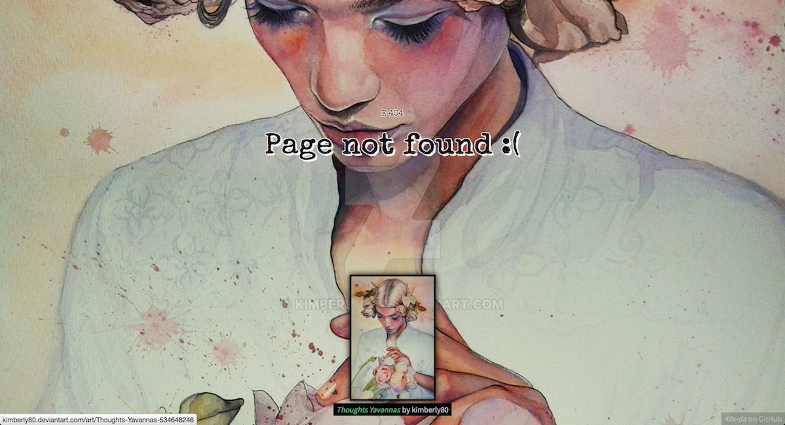

# 40x-da
Beautiful 40x error pages showing [DeviantArt's daily deviations](https://www.deviantart.com/dailydeviations/).

_This example shows [Thoughts Yavannas](http://kimberly80.deviantart.com/art/Thoughts-Yavannas-534648246) by [kimberly80](http://kimberly80.deviantart.com/)._

__40x-da__ works as a separate web-server delivering html content for http error pages (400, 401, 402, hence `40x`and even 50x ...). It is not meant to be publicly available on the internet (why would you give you user access to a bunch of 40x and 50x pages ?).

## Installation

Get a DeviantArt API access from [here](https://www.deviantart.com/developers/).

Clone this repo and install npm dependencies :

	$ cd /path/to/install/directory
	$ git clone https://github.com/as0n/40x-da.git
	$ cd 40x-da
	$ npm install

Run the server :

	$ node index.js YOUR_DA_CLIENT_ID YOUR_DA_CLIENT_SECRET

(maybe you should demonize the process using something like [forever](https://www.npmjs.com/package/forever)).

Configure you internet-facing webserver to proxy 40x and 50x error pages to the 40x-da server.
For instance on nginx you could do something like :

	server {
		...

		error_page	403	/errors/403
		error_page	404	/errors/404
		error_page	500	/errors/500

		location ~/errors/(\d+) {
			proxy_pass	http://127.0.0.1:8004/$1;
			allow all;
		}

		...
	}

## Features

 - Every http code is valid : you can GET any url like `http://40x-da-server/<status>` as long as `status` is a numeric value.
 - Custom error messages : message can be set via query parameters like so : `http://40x-da-server/404?message=These are not the droids you are looking for`.

## Todo

 - Add listening port parameter (either via `process.env` or `process.argv`);
 - Add message configuration file to customize displayed messages.

__Contributions welcomed !__
